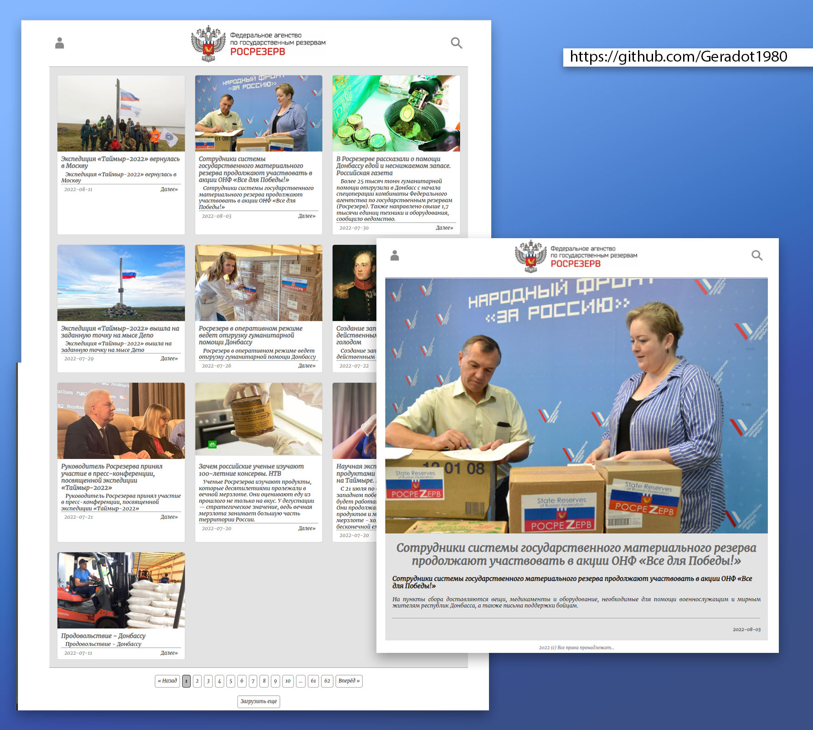

# Новостная лента. v 0.8 
 [Репозиторий с проектом](https://github.com/Geradot1980/pet_one) 
 
  [www.pet-one.geradot.st8.ru](http://pet-one.geradot.st8.ru/)

## Задачи (Тикеты)
0. Использовать публичное [API](https://rosrezerv.gov.ru/api/news)
1. Поднять проект на React.
2. Подключить библиотеку element-ui (и любые другие, если привык с ними работать).
3. На основе данных c api сделать страницу списка новостей с пагинатором. Карточки по 3 в ряд с отступом 24px между собой
4. Карточка новости содержит в себе картинку (поле image), заголовок (title), описание (preview, выводить первые 250 символов), дату (date, в формате DD,MM,YYYY), ссылку Далее (link).
5. Данные пагинатора в полях meta, links. Вывести ниже списка карточек, при клике запрашивать данные соответствующей страницы и обновлять компоненты.
6. Ниже пагинатора добавить кнопку "Загрузить еще". При нажатии догрузить еще 15 страниц.
7. Сделать. Загрузить в гит.
8. Опционально можно еще и дизайн дать. 

## Реализация поставленных задач
1. Все тикеты выполнены.
2. Использование useRef для отображения имеющейся содержания статьи "as is"
 

## Используемые технологии
1. Обработка запросов через terch.
2. CSS 
3. HTML (семантическая верстка)
4. React на хуках
5. Router  

## Итоги
1. Тикеты 2 и 8 решил, как и пагинатор, решил реализовать без дополнительных библиотек. 
2. Не стал специально выходить за рамки тех. задания, поэтому отсутствуют: адаптив, обработка отсутствующих картинок в статьях, не реализовал поиск и прочие элементы.

## Задачи на последующие изменения
1. Устранить проблему: При копировании адреса действующей страницы в новое окно браузера выдает ошибку, если добраться до нее через стартовую страницу все работает без проблем.
2. Переписать запросы через async/await.
3. Провести рефакторинг кода.
4. При переключении между страницами в пагинаторе начинать отображение страницы всегда сверху.

